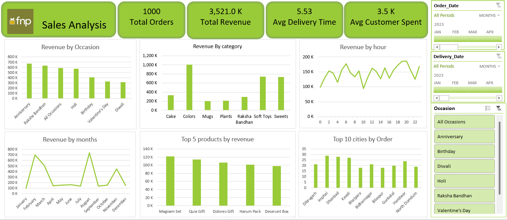

# 🌸 Ferns and Petals (FNP) Sales Analysis Dashboard

This project presents a sales analysis of **Ferns and Petals (FNP)** – a well-known gifting brand that delivers products for occasions like Anniversaries, Birthdays, Diwali, Raksha Bandhan, Holi, and more.

## 📌 Project Overview

The goal of this project is to analyze sales data to uncover actionable business insights, understand customer behavior, and evaluate sales trends. The final outcome is an interactive and visually compelling Excel dashboard that answers several key business questions.

### ✅ Business Questions Addressed:

- What is the total revenue?
- What is the average order and delivery time?
- How do monthly sales fluctuate?
- What are the top 5 products by revenue?
- What is the average customer spending?
- What are the top cities by order volume?
- How does revenue compare across different occasions?
- What products are popular for specific occasions?
- Does order quantity affect delivery time?

## 🛠️ Tools & Techniques Used

- **Microsoft Excel**
  - Data Cleaning & Preprocessing
  - Pivot Tables for summarization
  - Charts for visual representation
  - Slicers for interactive filtering

## 📁 Dataset

The raw dataset was provided in **CSV format** and includes:
- Order and delivery details
- Product categories
- Customer locations
- Occasion types
- Revenue and quantity metrics

## 🔍 Steps Followed

1. **Imported** raw data from CSV files into Excel
2. **Cleaned** the data by removing null values, correcting formats, and standardizing fields
3. **Transformed** the data to create calculated columns (e.g., Delivery Time, Revenue)
4. Used **Pivot Tables** to summarize:
   - Revenue by category, month, occasion
   - Product performance
   - Customer spending behavior
5. Created **charts and slicers** to build a fully functional dashboard

## 📊 Key Insights

- **Total Revenue**: ₹3.52 Million  
- **Total Orders**: 1000  
- **Average Delivery Time**: 5.53 hours  
- **Average Customer Spend**: ₹3.5K  
- **Top Occasions by Revenue**: Anniversary, Raksha Bandhan  
- **Top Products**: Magman Set, Quia Gift, Dolores Gift  
- **Top Cities by Orders**: Dibrugarh, Imphal, Dharwad, Kalyani  
- **Sales Peaks**: February and August  
- **Revenue Peaks by Hour**: Between 5 PM – 8 PM  

## 📷 Dashboard Preview

## 📬 Connect with Me

If you found this project insightful or want to collaborate, feel free to connect:

- [LinkedIn](https://www.linkedin.com/in/rohitkamble6458/)
- [Email](mailto:rohitkamble6458@gmail.com)

---

**Thanks for checking it out!** 😊

